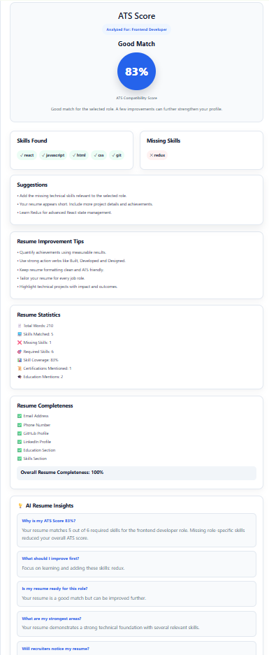
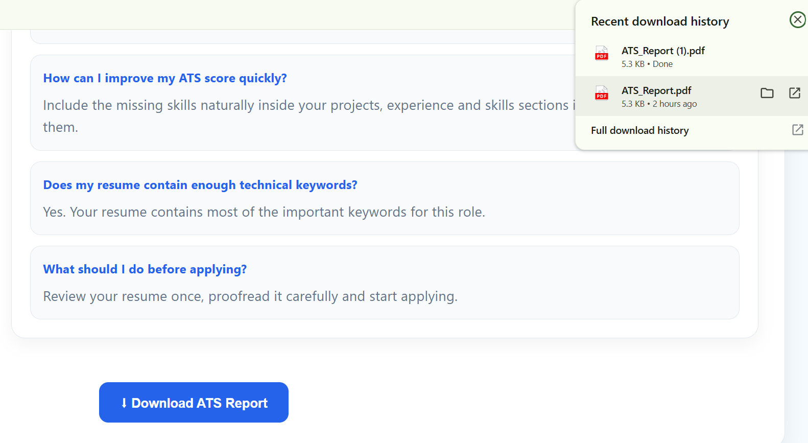

# 🤖 AI Resume Analyzer

An AI-powered Full Stack web application that analyzes resumes against a selected job role and provides an ATS compatibility score, missing skills, resume insights, and improvement suggestions.

---

## 📌 Features

* 📄 Upload Resume (PDF)
* 🎯 Select Target Job Role
* 🤖 AI-Based Resume Analysis
* 📊 ATS Compatibility Score
* ✅ Skills Found
* ❌ Missing Skills
* 💡 AI Resume Insights
* 📝 Resume Improvement Tips
* 📈 Resume Statistics
* 📋 Resume Completeness Check
* 📥 Download ATS Analysis Report (PDF)
* 📱 Responsive User Interface

---
## 📸 Screenshots

### 🏠 Home Page


---

### 📊 Resume Analysis



---

### 📄 Download ATS Report


## 🛠 Tech Stack

### Frontend

* React.js
* CSS3
* JavaScript (ES6)
* jsPDF

### Backend

* Node.js
* Express.js
* Multer
* pdf-parse

---

## 📂 Project Structure

```
AI-RESUME-ANALYZER
│
├── backend
│   ├── uploads
│   ├── server.js
│   ├── package.json
│
├── src
│   ├── components
│   │   ├── UploadBox.jsx
│   │   ├── ResultCard.jsx
│   │   ├── Navbar.jsx
│   │
│   ├── App.jsx
│   ├── App.css
│
├── public
├── package.json
└── README.md
```

---

## ⚙️ Installation

Clone the repository

```bash
git clone https://github.com/SanskritiParida/ai-resume-analyzer.git
```

Install frontend dependencies

```bash
npm install
```

Install backend dependencies

```bash
cd backend
npm install
```

Run backend

```bash
node server.js
```

Run frontend

```bash
npm run dev
```

---

## 🚀 How It Works

1. Upload a PDF resume.
2. Select a target job role.
3. The backend extracts resume text using PDF parsing.
4. Skills are compared against the selected role.
5. ATS score is calculated.
6. Missing skills, resume statistics, and AI insights are generated.
7. Download a professional ATS report as a PDF.

---

## 📈 Future Improvements

* User Authentication
* Resume History
* AI Resume Rewrite
* Cover Letter Generator
* Resume Comparison
* MongoDB Integration
* Interview Question Generator

---

## 👩‍💻 Author

Developed by **Sanskriti Parida**

GitHub: https://github.com/SanskritiParida
